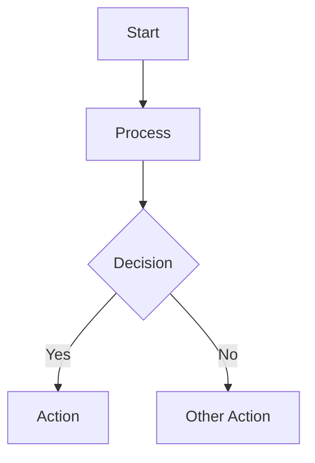
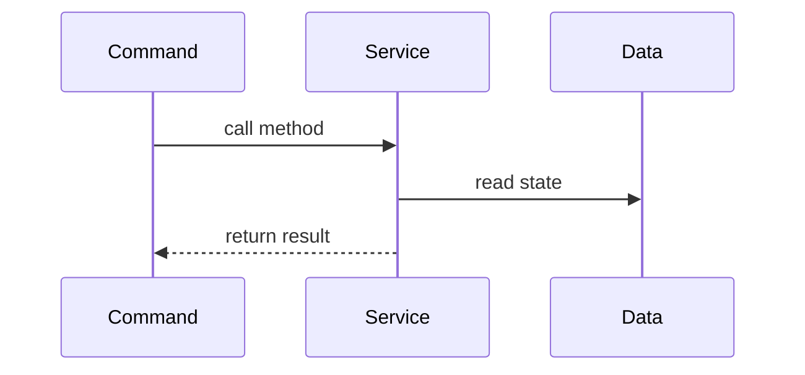
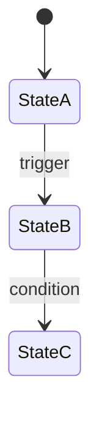

# Architecture Diagrams

**Version**: 1.0
**Last Updated**: 2025-10-06
**Purpose**: Visual representations of the ASCII Roguelike's architecture, systems, and data flows

---

## Overview

This folder contains Mermaid.js diagrams that complement the textual documentation. All diagrams are:
- **GitHub-native**: Render automatically in markdown viewers
- **Version-controlled**: Track changes alongside code
- **Text-based**: Easy to review in pull requests
- **Interactive**: Navigate relationships and dependencies visually

---

## Architecture & Layers

### Core Architecture
- **[Layered Architecture](./architecture-layers.md)** - UI → Command → Service → Data layers with data flow
- **[Service Dependencies](./service-dependencies.md)** - Dependency graph of all 33 services
- **[Data Model](./data-model.md)** - Entity relationships (GameState, Player, Monster, Level, Items)

**Use Cases**:
- Understanding the separation of concerns
- Identifying which service depends on which
- Navigating the data structure hierarchy

---

## System Flows

### Execution Flows
- **[Command Execution Flow](./command-flow.md)** - How MoveCommand orchestrates multiple services
- **[Turn Processing](./turn-sequence.md)** - What happens each game turn (hunger, fuel, FOV, monsters)
- **[Game Loop](./game-loop.md)** - Main game loop from initialization to game over

**Use Cases**:
- Tracing command execution path
- Understanding turn-based mechanics
- Debugging state update issues

---

## Core Systems

### Visibility & Rendering
- **[FOV Shadowcasting](./fov-shadowcasting.md)** - 8-octant recursive shadowcasting algorithm
- **[Lighting System](./lighting-system.md)** - Light sources, fuel consumption, FOV radius
- **[Visibility & Rendering](./visibility-rendering.md)** - Three-state visibility (visible/explored/unexplored)

**Use Cases**:
- Understanding field of view calculations
- Debugging visibility issues
- Implementing light source changes

---

## Advanced Systems

### Monster AI & Generation
- **[Monster AI States](./monster-ai-states.md)** - State machine (SLEEPING → WANDERING → HUNTING → FLEEING)
- **[Pathfinding (A*)](./pathfinding-astar.md)** - A* algorithm with Manhattan heuristic
- **[Dungeon Generation](./dungeon-generation.md)** - 10-step level generation pipeline

**Use Cases**:
- Debugging monster behavior
- Understanding pathfinding logic
- Modifying dungeon generation parameters

---

## Item Systems

### Items & Equipment
- **[Identification System](./identification-system.md)** - Unidentified → Identified flow
- **[Inventory & Equipment](./inventory-equipment.md)** - 26-slot inventory, equipment slots

**Use Cases**:
- Understanding item state management
- Implementing new item types
- Debugging equipment issues

---

## Testing Architecture

### Test Organization
- **[Test Organization](./test-organization.md)** - Scenario-based test structure, MockRandom pattern

**Use Cases**:
- Writing new tests
- Understanding test organization
- Debugging failing tests

---

## How to Read These Diagrams

### Diagram Types

**Flowcharts** (Process flow):

**Sequence Diagrams** (Service interactions):

**State Diagrams** (State machines):

**Graph Diagrams** (Dependencies):

---

## Diagram Conventions

### Color Coding

- **Blue** (`#4A90E2`): UI Layer components
- **Green** (`#7ED321`): Command Layer components
- **Orange** (`#F5A623`): Service Layer components
- **Purple** (`#BD10E0`): Data Layer components
- **Red** (`#D0021B`): Critical paths or errors
- **Gray** (`#9B9B9B`): Deprecated or optional

### Arrow Types

- **Solid arrow** (`-->`) : Direct dependency or data flow
- **Dotted arrow** (`-.->`) : Indirect dependency or return value
- **Thick arrow** (`==>`) : Primary/critical path
- **Labeled arrow** : Explains the relationship

### Node Shapes

- **Rectangle** : Service or component
- **Rounded rectangle** : Command or operation
- **Diamond** : Decision point
- **Circle** : State
- **Hexagon** : External system (LocalStorage, JSON)

---

## Contributing to Diagrams

### When to Update

**Add new diagrams** when:
- Implementing a new major system
- Architecture changes significantly
- New developers request visual aids

**Update existing diagrams** when:
- Service dependencies change
- Data model changes
- Command flows change

### Mermaid Syntax

All diagrams use [Mermaid.js](https://mermaid.js.org/) syntax. Key resources:
- [Flowchart Syntax](https://mermaid.js.org/syntax/flowchart.html)
- [Sequence Diagram](https://mermaid.js.org/syntax/sequenceDiagram.html)
- [State Diagram](https://mermaid.js.org/syntax/stateDiagram.html)
- [Class Diagram](https://mermaid.js.org/syntax/classDiagram.html)

### Testing Diagrams Locally

**VS Code**:
Install "Markdown Preview Mermaid Support" extension

**Online**:
Use [Mermaid Live Editor](https://mermaid.live/) to preview and debug

**GitHub**:
Diagrams render automatically in markdown files

---

## Quick Navigation

### By Use Case

**I want to understand...**
- How commands work → [Command Flow](./command-flow.md)
- How services interact → [Service Dependencies](./service-dependencies.md)
- How monsters behave → [Monster AI States](./monster-ai-states.md)
- How levels are generated → [Dungeon Generation](./dungeon-generation.md)
- How FOV works → [FOV Shadowcasting](./fov-shadowcasting.md)
- How turns work → [Turn Processing](./turn-sequence.md)

**I'm implementing...**
- A new service → [Architecture Layers](./architecture-layers.md), [Service Dependencies](./service-dependencies.md)
- A new command → [Command Flow](./command-flow.md)
- Monster AI changes → [Monster AI States](./monster-ai-states.md), [Pathfinding](./pathfinding-astar.md)
- Item system changes → [Identification](./identification-system.md), [Inventory](./inventory-equipment.md)

**I'm debugging...**
- Visibility issues → [FOV Shadowcasting](./fov-shadowcasting.md), [Visibility](./visibility-rendering.md)
- Monster behavior → [Monster AI States](./monster-ai-states.md)
- Command execution → [Command Flow](./command-flow.md), [Turn Sequence](./turn-sequence.md)
- Data model issues → [Data Model](./data-model.md)

---

## Related Documentation

**Core Docs**:
- [Architecture](../architecture.md) - Textual architecture documentation
- [Core Systems](../systems-core.md) - Lighting, FOV, Rendering
- [Advanced Systems](../systems-advanced.md) - Monster AI, Pathfinding, Dungeon Generation
- [Testing Strategy](../testing-strategy.md) - Test organization and patterns

**Service Docs**:
- [Services Index](../services/README.md) - All 33 services documentation

**Game Design**:
- [Game Design Index](../game-design/README.md) - Gameplay mechanics and rules

---

**Last Updated**: 2025-10-06
**Maintained By**: Development Team
**Feedback**: Submit issues or PRs to improve diagrams
