# Layered Architecture Diagram

**Version**: 1.0
**Last Updated**: 2025-10-06
**Related Docs**: [Architecture](../architecture.md) | [Core Systems](../systems-core.md)

---

## Overview

This diagram illustrates the **4-layer architecture** of the ASCII Roguelike, showing clear separation of concerns and unidirectional data flow from UI to Data layers.

**Key Principles**:
- **Separation of Concerns**: Each layer has a single responsibility
- **Immutability**: State updates return new objects (functional approach)
- **Dependency Injection**: Services injected into Commands for testability
- **No Logic Leakage**: UI has no game logic; Commands have no implementation details

---

## High-Level Architecture

```mermaid
graph TB
    subgraph UI["🖥️ UI Layer (Vanilla TypeScript + DOM)"]
        Renderer[GameRenderer<br/>Renders state to DOM]
        Input[InputHandler<br/>Captures keyboard input]
        Menus[Menus & Modals<br/>VictoryScreen, DeathScreen]
    end

    subgraph CMD["⚙️ Command Layer (Orchestration)"]
        MoveCmd[MoveCommand]
        AttackCmd[AttackCommand]
        UseItemCmd[UseItemCommand]
        OtherCmd[40+ Commands...]
    end

    subgraph SVC["🧠 Service Layer (Game Logic)"]
        Combat[CombatService]
        Movement[MovementService]
        FOV[FOVService]
        Lighting[LightingService]
        Hunger[HungerService]
        MonsterAI[MonsterAIService]
        OtherSvc[30+ Services...]
    end

    subgraph DATA["💾 Data Layer"]
        GameState[GameState<br/>Immutable State]
        LocalStore[LocalStorageService<br/>Persistence]
        JSON[JSON Data Files<br/>monsters.json, items.json]
    end

    Input -->|User Input| CMD
    CMD -->|Orchestrate| SVC
    SVC -->|Read/Write| DATA
    DATA -.->|State| Renderer
    Renderer -->|Display| UI

    style UI fill:#4A90E2,color:#fff
    style CMD fill:#7ED321,color:#000
    style SVC fill:#F5A623,color:#000
    style DATA fill:#BD10E0,color:#fff
```



---

## Detailed Layer Responsibilities

### UI Layer (Blue)

**Purpose**: Presentation and user input capture only

**Components**:
- `GameRenderer` - Renders GameState to DOM (ASCII grid, stats, messages)
- `InputHandler` - Captures keyboard events, maps to commands
- `VictoryScreen` - Victory modal with final stats
- `DeathScreen` - Death modal with comprehensive stats
- `MainMenu` - Start/continue/leaderboard/quit
- `HelpModal` - Command reference
- `MessageHistoryModal` - Scrollable message log

**Rules**:
- ✅ Render GameState to DOM
- ✅ Capture user input
- ✅ Convert input to Command instances
- ❌ **NO game logic** (no calculations, no state mutations)
- ❌ **NO business rules** (no combat formulas, no hunger calculations)

**Example** (GameRenderer):
```typescript
// ✅ Good - Render only
render(state: GameState): void {
  this.renderGrid(state.currentLevel, state.visibleCells)
  this.renderPlayer(state.player)
  this.renderMessages(state.messages)
}

// ❌ Bad - Contains logic
render(state: GameState): void {
  const hp = state.player.hp - 10  // NO! Logic in UI
  this.renderHP(hp)
}
```

---

### Command Layer (Green)

**Purpose**: Orchestrate service calls, coordinate multi-step operations

**Components**:
- `MoveCommand` - Movement + FOV + hunger + fuel + monster turns
- `AttackCommand` - Combat + XP + death checks
- `UseItemCommand` - Item consumption + effects
- `RestCommand` - Multi-turn healing loop
- 40+ total commands

**Interface**:
```typescript
interface ICommand {
  execute(state: GameState): GameState
}
```

**Rules**:
- ✅ Call services in correct order
- ✅ Simple routing logic (`if monster then attack else move`)
- ✅ Coordinate multi-step operations
- ✅ Return new immutable GameState
- ❌ **NO game logic** (no loops, calculations, or business rules)
- ❌ **NO duplicate logic** (extract to services)

**Example** (MoveCommand):
```typescript
// ✅ Good - Orchestration only
execute(state: GameState): GameState {
  const newPos = this.movement.calculateNewPosition(...)  // Service
  const monster = this.movement.getEntityAt(newPos, state)  // Service

  if (monster) {
    return this.attack.execute(state, monster)  // Delegate to AttackCommand
  }

  let newPlayer = { ...state.player, position: newPos }
  newPlayer = this.hunger.tickHunger(newPlayer)  // Service
  newPlayer = this.lighting.tickFuel(newPlayer)  // Service

  const visibleCells = this.fov.computeFOV(newPos, ...)  // Service
  const turnCount = this.turn.incrementTurn(state.turnCount)  // Service

  return { ...state, player: newPlayer, visibleCells, turnCount }
}

// ❌ Bad - Logic in command
execute(state: GameState): GameState {
  // NO! Calculation in command
  const damage = Math.floor(Math.random() * 10)
  const newHp = state.player.hp - damage
  return { ...state, player: { ...state.player, hp: newHp } }
}
```

---

### Service Layer (Orange)

**Purpose**: All game logic and business rules

**Components** (33 Services):

**Combat & Movement**:
- `CombatService` - Hit/damage calculations, attack resolution
- `MovementService` - Position validation, collision detection
- `SpecialAbilityService` - Monster special attacks (rust, steal, drain)

**Core Systems**:
- `FOVService` - Field of view (recursive shadowcasting)
- `LightingService` - Light source management, fuel tracking
- `RenderingService` - Visibility states, color selection
- `HungerService` - Food tracking, hunger effects
- `RegenerationService` - HP regeneration with blocking conditions

**Dungeon & Monsters**:
- `DungeonService` - Level generation orchestration
- `RoomGenerationService` - Room placement with collision detection
- `CorridorGenerationService` - Corridor path generation
- `MonsterAIService` - AI behavior decision-making
- `MonsterTurnService` - Process all monster turns
- `PathfindingService` - A* pathfinding algorithm

**Items & Inventory**:
- `InventoryService` - Item management, equipment
- `PotionService` - Potion effects
- `ScrollService` - Scroll effects with targeting
- `WandService` - Wand usage and charges
- `IdentificationService` - Item name generation, identification
- `TrapService` - Trap effects and triggers

**UI Support**:
- `MessageService` - Combat log management
- `NotificationService` - Context-aware auto-notifications
- `ContextService` - Contextual command suggestions
- `TurnService` - Turn counter management
- `VictoryService` - Win condition and score calculation
- `DeathService` - Death statistics and achievements

**Utilities**:
- `RandomService` - Seeded RNG (injectable interface)
- `LocalStorageService` - Game persistence
- `DebugService` - Debug commands and visualizations

**Rules**:
- ✅ Contains ALL game logic
- ✅ Pure functions where possible (stateless)
- ✅ Immutable updates (return new objects)
- ✅ Dependency injection (RandomService, other services)
- ✅ Comprehensive unit tests (>80% coverage)

**Example** (CombatService):
```typescript
// ✅ Good - Pure logic, testable
calculateDamage(weapon: Weapon, strength: number): number {
  const baseDamage = this.random.roll(weapon.damage)  // Injected RNG
  const modifier = this.getStrengthModifier(strength)
  return baseDamage + weapon.bonus + modifier
}

// ✅ Good - Immutable
applyDamage(entity: Entity, damage: number): Entity {
  return { ...entity, hp: Math.max(0, entity.hp - damage) }
}
```

---

### Data Layer (Purple)

**Purpose**: State storage and persistence

**Components**:
- `GameState` - Root game state (player, levels, messages, turn count)
- `LocalStorageService` - Save/load with JSON serialization
- `monsters.json` - Monster definitions (26 types)
- `items.json` - Item definitions (weapons, armor, potions, scrolls, etc.)
- `config.json` - Game configuration

**GameState Structure**:
```typescript
interface GameState {
  player: Player
  currentLevel: number
  levels: Map<number, Level>  // 1-10
  visibleCells: Set<string>   // FOV cache
  messages: Message[]
  turnCount: number
  seed: string                // Dungeon generation seed
  gameId: string              // Save file ID
  itemNameMap: ItemNameMap    // Random names per game
  identifiedItems: Set<string>
  hasAmulet: boolean
  isGameOver: boolean
  hasWon: boolean
  // ... stats tracking
}
```

**Rules**:
- ✅ Immutable data structures (Maps, Sets, objects)
- ✅ JSON-serializable (for LocalStorage)
- ✅ Single source of truth
- ❌ No logic in data structures (pure data)

---

## Data Flow Example: MoveCommand


**Observations**:
1. **Command orchestrates** - No logic, just service calls
2. **Services are pure** - Take input, return output
3. **Immutability** - Every update returns new object
4. **Order matters** - FOV needs new position, hunger needs rings
5. **Single direction** - Data flows UI → CMD → SVC → DATA

---

## Dependency Inversion Example

**Problem**: How do services test random behavior?

**Solution**: Inject `IRandomService` interface


**Benefits**:
- ✅ Services testable with `MockRandom` (deterministic)
- ✅ Production uses `SeededRandom` (reproducible dungeons)
- ✅ Services depend on abstraction, not concrete implementation

---

## Immutability Pattern

**Core Principle**: Never mutate state, always return new objects

```typescript
// ❌ BAD - Mutation
function tickFuel(lightSource: LightSource): LightSource {
  lightSource.fuel -= 1  // MUTATION!
  return lightSource
}

// ✅ GOOD - Immutable
function tickFuel(lightSource: LightSource): LightSource {
  return {
    ...lightSource,     // Spread operator
    fuel: lightSource.fuel - 1
  }
}
```

**Benefits**:
- ✅ Time-travel debugging (undo/redo)
- ✅ Easier testing (no side effects)
- ✅ React-style state updates
- ✅ Save/load simplification

---

## Architectural Rules Summary

### UI Layer
- ✅ Render state
- ✅ Capture input
- ❌ NO game logic

### Command Layer
- ✅ Orchestrate services
- ✅ Simple routing
- ❌ NO loops, calculations, or business rules

### Service Layer
- ✅ ALL game logic
- ✅ Pure functions
- ✅ Dependency injection

### Data Layer
- ✅ Immutable state
- ✅ Single source of truth
- ❌ No logic

---

## Related Diagrams

- **[Service Dependencies](./service-dependencies.md)** - Which services depend on which
- **[Command Flow](./command-flow.md)** - Detailed MoveCommand execution
- **[Data Model](./data-model.md)** - GameState entity relationships

---

## References

- **[Architecture Documentation](../architecture.md)** - Detailed textual documentation
- **[ARCHITECTURAL_REVIEW.md](../ARCHITECTURAL_REVIEW.md)** - Pre-commit checklist
- **[CLAUDE.md](../../CLAUDE.md)** - Project instructions and patterns

---

**Last Updated**: 2025-10-06
**Maintained By**: Development Team
