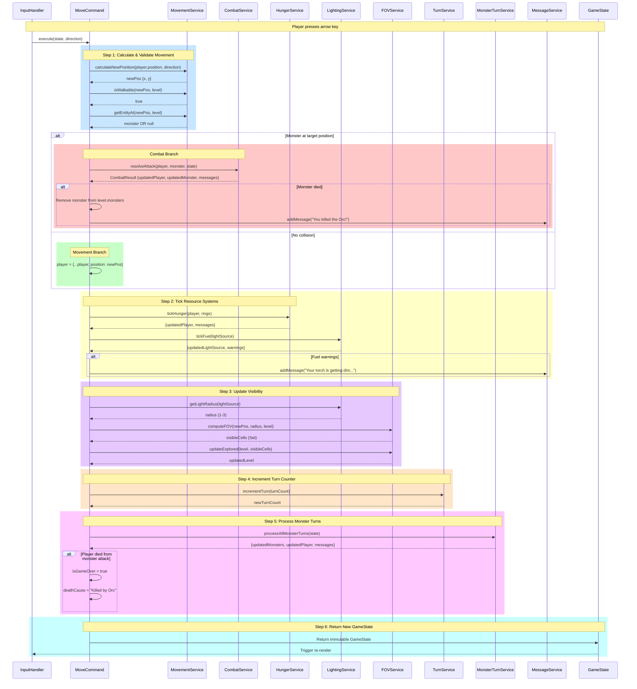

# Command Execution Flow

**Version**: 1.0
**Last Updated**: 2025-10-06
**Related Docs**: [Architecture](../architecture.md) | [Commands Index](../commands/README.md)

---

## Overview

This diagram shows the **detailed execution flow** of MoveCommand, demonstrating how a command orchestrates multiple services to update game state. This pattern applies to all 40+ commands in the system.

**Key Principles**:
- **Orchestration**: Commands coordinate service calls, don't implement logic
- **Immutability**: Every step returns new objects
- **Order Matters**: Services must be called in correct sequence
- **Pure Functions**: Services are stateless (return deterministic output)

---

## MoveCommand Complete Flow



---

## Step-by-Step Breakdown

### Step 1: Calculate & Validate Movement

**Purpose**: Determine new position and check for collisions

```typescript
// Calculate target position
const direction = { x: 1, y: 0 }  // Moving right
const newPos = this.movementService.calculateNewPosition(
  player.position,
  direction
)
// newPos = { x: 11, y: 5 }

// Validate walkability
const walkable = this.movementService.isWalkable(newPos, level)
if (!walkable) {
  return state  // Blocked by wall
}

// Check for entity collision
const entity = this.movementService.getEntityAt(newPos, state)
if (entity) {
  // Delegate to AttackCommand
  return this.attackCommand.execute(state, entity)
}
```

**Service Calls**: 3
- `calculateNewPosition()` - Simple math
- `isWalkable()` - Tile lookup
- `getEntityAt()` - Monster/item search

---

### Step 2: Update Player Position

**Purpose**: Move player to new position (immutable)

```typescript
const newPlayer = {
  ...player,
  position: newPos
}
```

**Service Calls**: 0 (direct state update)

---

### Step 3: Tick Resource Systems

**Purpose**: Consume hunger and fuel per turn

**Hunger**:
```typescript
const hungerResult = this.hungerService.tickHunger(newPlayer, rings)
// Returns: { player: updatedPlayer, messages: ["You are hungry!"] }

newPlayer = hungerResult.player
messages.push(...hungerResult.messages)
```

**Fuel**:
```typescript
if (lightSource && !lightSource.isPermanent) {
  const fuelResult = this.lightingService.tickFuel(lightSource)
  // Returns: { lightSource: updatedSource, warnings: ["Your torch is getting dim..."] }

  newPlayer.equipment.lightSource = fuelResult.lightSource
  messages.push(...fuelResult.warnings)
}
```

**Service Calls**: 2
- `HungerService.tickHunger()`
- `LightingService.tickFuel()`

---

### Step 4: Recompute Field of View

**Purpose**: Update visible cells based on new position and light radius

```typescript
// Get light radius
const radius = this.lightingService.getLightRadius(lightSource)
// radius = 2 (torch or lantern)

// Compute FOV
const visibleCells = this.fovService.computeFOV(
  newPos,
  radius,
  level
)
// visibleCells = Set(["10,5", "11,5", "12,5", ...])

// Update explored tiles
const updatedLevel = this.fovService.updateExplored(
  level,
  visibleCells
)
```

**Service Calls**: 3
- `LightingService.getLightRadius()`
- `FOVService.computeFOV()`
- `FOVService.updateExplored()`

---

### Step 5: Increment Turn Counter

**Purpose**: Track game time

```typescript
const newTurnCount = this.turnService.incrementTurn(state.turnCount)
// turnCount: 42 → 43
```

**Service Calls**: 1
- `TurnService.incrementTurn()`

---

### Step 6: Process Monster Turns

**Purpose**: All monsters take their turns after player acts

```typescript
const monsterResult = this.monsterTurnService.processAllMonsterTurns({
  ...state,
  player: newPlayer,
  visibleCells,
  turnCount: newTurnCount
})

// Returns: {
//   monsters: updatedMonsters,
//   player: playerAfterMonsterAttacks,
//   messages: ["Orc attacks!", "Bat misses!"]
// }

newPlayer = monsterResult.player
const updatedMonsters = monsterResult.monsters
messages.push(...monsterResult.messages)
```

**Service Calls**: 1 (but internally calls many services)
- `MonsterTurnService.processAllMonsterTurns()`
  - Internally calls: MonsterAIService, CombatService, PathfindingService, etc.

---

### Step 7: Return New GameState

**Purpose**: Build final immutable state

```typescript
return {
  ...state,
  player: newPlayer,
  currentLevel: state.currentLevel,
  levels: new Map(state.levels).set(depth, updatedLevel),
  visibleCells: visibleCells,
  messages: [...state.messages, ...messages],
  turnCount: newTurnCount,
  isGameOver: newPlayer.hp <= 0,
  deathCause: newPlayer.hp <= 0 ? "Death cause" : undefined
}
```

**Immutability**: Every field uses spread operators or new constructors

---

## Orchestration Pattern

**Commands ONLY orchestrate** - notice the pattern:

```typescript
// ✅ Good - Orchestration
execute(state: GameState, direction: Direction): GameState {
  const newPos = this.movement.calculateNewPosition(...)  // Service
  const walkable = this.movement.isWalkable(...)          // Service
  const entity = this.movement.getEntityAt(...)           // Service

  if (entity) {
    return this.attack.execute(...)                       // Delegate
  }

  let newPlayer = { ...state.player, position: newPos }
  newPlayer = this.hunger.tickHunger(newPlayer)           // Service
  newPlayer = this.lighting.tickFuel(newPlayer)           // Service

  const visibleCells = this.fov.computeFOV(...)           // Service
  const turnCount = this.turn.incrementTurn(...)          // Service

  return { ...state, player: newPlayer, visibleCells, turnCount }
}
```

**No Logic**:
- ❌ No loops (no `for`, `forEach`, `map`)
- ❌ No calculations (no `Math.*`, arithmetic)
- ❌ No business rules (no complex conditionals)

**Only Orchestration**:
- ✅ Service calls
- ✅ Simple routing (`if monster then attack`)
- ✅ Immutable state building

---

## Service Call Count

**MoveCommand total service calls**: ~12

| Service | Calls | Purpose |
|---------|-------|---------|
| MovementService | 3 | Position calc, walkable check, collision |
| CombatService | 0-1 | If monster collision |
| HungerService | 1 | Tick hunger |
| LightingService | 2-3 | Tick fuel, get radius |
| FOVService | 2 | Compute FOV, update explored |
| TurnService | 1 | Increment turn |
| MonsterTurnService | 1 | Process all monsters |
| MessageService | 0-3 | Add combat/warning messages |

**Total**: 10-14 service calls per move command

---

## Comparison: Move vs Attack vs Rest

### MoveCommand (10-14 calls)
```
MovementService (3) → HungerService (1) → LightingService (2) →
FOVService (2) → TurnService (1) → MonsterTurnService (1)
```

### AttackCommand (8-10 calls)
```
CombatService (2) → LevelingService (0-1) → MessageService (1) →
HungerService (1) → LightingService (1) → FOVService (1) →
TurnService (1) → MonsterTurnService (1)
```

### RestCommand (5 calls × N turns)
```
Loop:
  RegenerationService (1) → HungerService (1) → LightingService (1) →
  FOVService (1) → TurnService (1)
Until: HP == maxHP OR enemy in FOV OR hunger == 0
```

**Pattern**: All commands follow same orchestration structure

---

## Immutability Example

**Nested immutability** (player inside state):

```typescript
// ❌ BAD - Mutation
state.player.hp -= damage
state.turnCount += 1
return state

// ✅ GOOD - Immutable
const newPlayer = {
  ...state.player,
  hp: state.player.hp - damage
}

return {
  ...state,
  player: newPlayer,
  turnCount: state.turnCount + 1
}
```

**Map/Set immutability**:

```typescript
// ❌ BAD - Mutation
state.levels.set(depth, updatedLevel)
state.visibleCells.add(posKey)
return state

// ✅ GOOD - Immutable
const newLevels = new Map(state.levels)
newLevels.set(depth, updatedLevel)

const newVisibleCells = new Set(state.visibleCells)
newVisibleCells.add(posKey)

return {
  ...state,
  levels: newLevels,
  visibleCells: newVisibleCells
}
```

---

## Error Handling

**Commands handle errors by returning unchanged state**:

```typescript
execute(state: GameState, direction: Direction): GameState {
  const newPos = this.movement.calculateNewPosition(...)

  // Validation
  if (!this.movement.isWalkable(newPos, level)) {
    return state  // No change, blocked
  }

  // ... rest of execution
}
```

**No exceptions thrown** - game continues with original state

---

## Testing Commands

**Mock services** for unit tests:

```typescript
test('MoveCommand updates player position', () => {
  // Arrange
  const mockMovement = {
    calculateNewPosition: jest.fn().mockReturnValue({ x: 11, y: 5 }),
    isWalkable: jest.fn().mockReturnValue(true),
    getEntityAt: jest.fn().mockReturnValue(null)
  }
  const command = new MoveCommand(mockMovement, ...)

  // Act
  const result = command.execute(state, direction)

  // Assert
  expect(result.player.position).toEqual({ x: 11, y: 5 })
  expect(mockMovement.calculateNewPosition).toHaveBeenCalledWith(...)
})
```

**Benefits**:
- ✅ Fast (no real services)
- ✅ Isolated (only tests orchestration)
- ✅ Deterministic (mocked returns)

---

## Related Diagrams

- **[Architecture Layers](./architecture-layers.md)** - How commands fit in architecture
- **[Service Dependencies](./service-dependencies.md)** - Which services commands use
- **[Turn Sequence](./turn-sequence.md)** - What happens after command executes

---

## References

- **[Commands Index](../commands/README.md)** - All 40+ command documentation
- **[MoveCommand](../commands/move.md)** - MoveCommand detailed docs
- **[Architecture](../architecture.md)** - Command layer specifications
- **[ARCHITECTURAL_REVIEW.md](../ARCHITECTURAL_REVIEW.md)** - Command review checklist

---

**Last Updated**: 2025-10-06
**Maintained By**: Development Team
**Example Command**: MoveCommand (applies to all commands)
