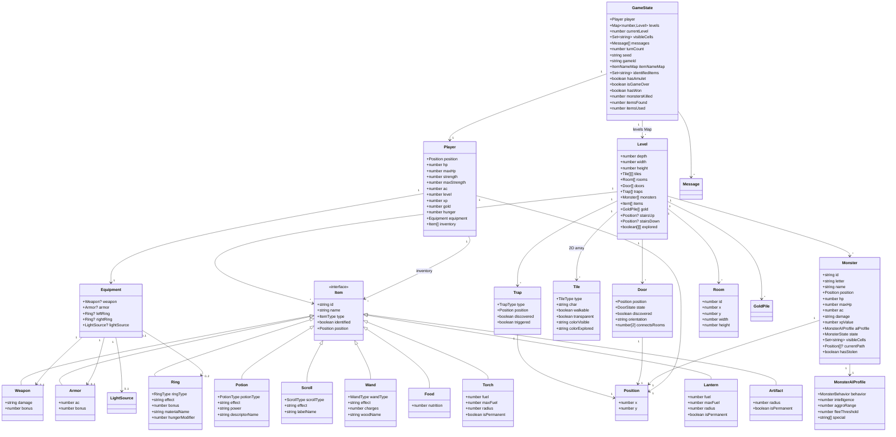
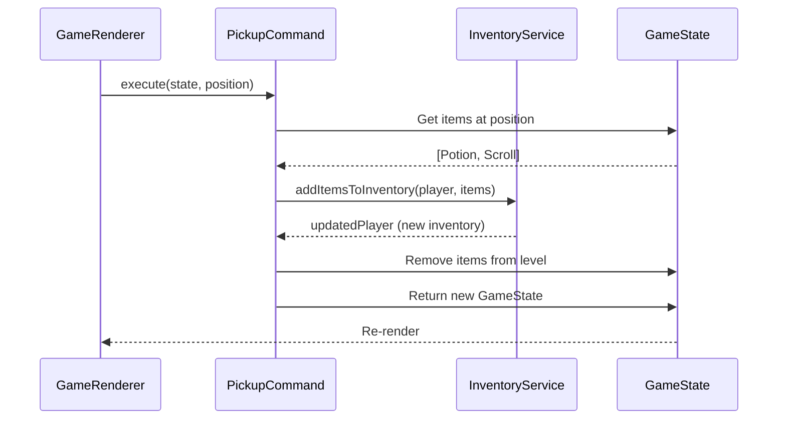

# Data Model & Entity Relationships

**Version**: 1.0
**Last Updated**: 2025-10-06
**Related Docs**: [Architecture](../architecture.md) | [Core Types](../../src/types/core/core.ts)

---

## Overview

This diagram shows the **entity relationships** and data structures in the ASCII Roguelike. All data is **immutable** - state updates return new objects using spread operators.

**Key Data Structures**:
- **GameState** - Root state containing everything
- **Player** - Character state, inventory, equipment
- **Level** - Dungeon level with tiles, monsters, items
- **Monster** - AI-controlled entities
- **Items** - Weapons, armor, potions, scrolls, etc.

---

## Complete Data Model



---

## GameState - Root State

**Purpose**: Single source of truth for entire game

```typescript
interface GameState {
  // Player
  player: Player

  // Levels (Map for O(1) lookup)
  currentLevel: number          // 1-10
  levels: Map<number, Level>    // All generated levels persist

  // Visibility
  visibleCells: Set<string>     // FOV cache (position keys)

  // Messages
  messages: Message[]           // Combat log

  // Time
  turnCount: number             // Game turns elapsed

  // Random generation
  seed: string                  // Dungeon generation seed
  itemNameMap: ItemNameMap      // Random item names per game

  // Identification
  identifiedItems: Set<string>  // Identified item types

  // Win/Loss
  hasAmulet: boolean            // Has Amulet of Yendor
  isGameOver: boolean           // Death occurred
  hasWon: boolean               // Victory achieved

  // Statistics
  monstersKilled: number
  itemsFound: number
  itemsUsed: number
  levelsExplored: number

  // Meta
  gameId: string                // Unique save ID
  deathCause?: string           // Death reason
}
```

**Immutability Example**:
```typescript
// ❌ BAD - Mutation
state.turnCount += 1

// ✅ GOOD - Immutable
const newState = {
  ...state,
  turnCount: state.turnCount + 1
}
```

---

## Player State

**Purpose**: Character attributes, inventory, equipment

```typescript
interface Player {
  position: Position            // Current location
  hp: number                    // Current hit points
  maxHp: number                 // Maximum hit points
  strength: number              // Current strength
  maxStrength: number           // Maximum strength
  ac: number                    // Armor class (lower = better)
  level: number                 // Character level
  xp: number                    // Experience points
  gold: number                  // Gold collected
  hunger: number                // Food units (0-2000)
  equipment: Equipment          // Worn/wielded items
  inventory: Item[]             // 26-slot inventory (a-z)
}
```

**Relationship**:
- **1:1 with Position** - Player always has a position
- **1:1 with Equipment** - Equipment struct always exists (slots may be null)
- **1:Many with Items** - Inventory array (max 26 items)

---

## Equipment Slots

**Purpose**: Equipped items that affect stats

```typescript
interface Equipment {
  weapon: Weapon | null         // Wielded weapon (affects damage)
  armor: Armor | null           // Worn armor (affects AC)
  leftRing: Ring | null         // Left hand ring
  rightRing: Ring | null        // Right hand ring
  lightSource: Torch | Lantern | Artifact | null  // Equipped light
}
```

**Design Notes**:
- All slots nullable (player may have nothing equipped)
- Rings affect hunger rate (Ring of Regeneration +30%, Slow Digestion -50%)
- Light source determines FOV radius (1-3 tiles)
- Cursed items cannot be unequipped (future feature)

---

## Level Structure

**Purpose**: Single dungeon level with all entities

```typescript
interface Level {
  depth: number                 // 1-10
  width: number                 // 80
  height: number                // 22
  tiles: Tile[][]               // 2D terrain array
  rooms: Room[]                 // Room definitions (6-12 per level)
  doors: Door[]                 // Door positions and states
  traps: Trap[]                 // Trap positions (hidden until discovered)
  monsters: Monster[]           // AI entities
  items: Item[]                 // Loot on ground
  gold: GoldPile[]              // Gold piles
  stairsUp: Position | null     // Up stairs (null on Level 1)
  stairsDown: Position | null   // Down stairs (null on Level 10)
  explored: boolean[][]         // Fog of war / memory
}
```

**Relationship**:
- **Many Tiles** (80 × 22 = 1,760 tiles)
- **6-12 Rooms** per level
- **Multiple entities** (monsters, items, doors, traps)

**Storage**:
- Levels stored in `Map<number, Level>` in GameState
- All generated levels persist (can revisit previous levels)
- Explored state saved per level

---

## Monster Entity

**Purpose**: AI-controlled enemy

```typescript
interface Monster {
  id: string                    // Unique identifier
  letter: string                // A-Z display character
  name: string                  // "Aquator", "Orc", "Dragon"
  position: Position            // Current location
  hp: number                    // Current hit points
  maxHp: number                 // Maximum hit points
  ac: number                    // Armor class
  damage: string                // Dice notation: "1d8", "2d4"
  xpValue: number               // XP reward for killing
  aiProfile: MonsterAIProfile   // Behavior definition
  state: MonsterState           // SLEEPING, WANDERING, HUNTING, FLEEING
  visibleCells: Set<string>     // Monster's FOV (when awake)
  currentPath: Position[] | null // Cached A* path
  hasStolen: boolean            // Thief flag (Leprechaun, Nymph)
  level: number                 // Spawn level
}
```

**AI Profile**:
```typescript
interface MonsterAIProfile {
  behavior: MonsterBehavior     // SMART, GREEDY, ERRATIC, etc.
  intelligence: number          // 1-10 scale
  aggroRange: number            // Wake-up distance (tiles)
  fleeThreshold: number         // HP % to flee (0.0-1.0)
  special: string[]             // ["RUSTS_ARMOR", "STEALS_GOLD"]
}
```

**State Machine**:
```
SLEEPING → WANDERING → HUNTING → FLEEING
```

---

## Item Hierarchy

**Base Interface**:
```typescript
interface Item {
  id: string
  name: string
  type: ItemType               // WEAPON, ARMOR, POTION, etc.
  identified: boolean          // Has player identified this type?
  position: Position           // Where item is located
}
```

**Item Types** (9 total):
1. **Weapon** - Melee weapons (damage dice, bonus)
2. **Armor** - Body armor (AC, bonus)
3. **Potion** - Single-use consumables (13 types)
4. **Scroll** - Magic scrolls (11 types)
5. **Ring** - Stat-modifying jewelry (10 types)
6. **Wand** - Rechargeable magic (8 types)
7. **Food** - Rations (restore hunger)
8. **Torch** - Consumable light (500 turns fuel)
9. **Lantern** - Refillable light (500 turns fuel)
10. **Artifact** - Permanent light (∞ fuel)

**Polymorphism**: Each type extends `Item` with specific properties

---

## Map & Set Usage

**Why Maps and Sets?**

**Map<number, Level>**:
- O(1) lookup by level depth
- Clearer than `Level[]` with sparse indices
- Easier to serialize (convert to Array for JSON)

**Set<string>**:
- O(1) contains check
- No duplicates (perfect for FOV cells)
- Position keys: `"x,y"` format

**Example**:
```typescript
// Check if position is visible
const key = `${pos.x},${pos.y}`
if (visibleCells.has(key)) {
  // Render with full color
}
```

---

## Immutability Pattern

**All state updates use spread operators**:

```typescript
// Update player HP (immutable)
const newPlayer = {
  ...player,
  hp: Math.max(0, player.hp - damage)
}

// Update GameState (nested immutability)
const newState = {
  ...state,
  player: newPlayer,
  turnCount: state.turnCount + 1
}

// Update Map (create new Map)
const newLevels = new Map(state.levels)
newLevels.set(depth, updatedLevel)

const newState = {
  ...state,
  levels: newLevels
}

// Update Set (create new Set)
const newVisibleCells = new Set(state.visibleCells)
newVisibleCells.add(positionKey)

const newState = {
  ...state,
  visibleCells: newVisibleCells
}
```

---

## Serialization (LocalStorage)

**Challenge**: Maps and Sets aren't JSON-serializable

**Solution**: Custom serialization

```typescript
// Serialize
const serializable = {
  ...state,
  levels: Array.from(state.levels.entries()),    // Map → Array
  visibleCells: Array.from(state.visibleCells),  // Set → Array
  identifiedItems: Array.from(state.identifiedItems)
}
const json = JSON.stringify(serializable)

// Deserialize
const data = JSON.parse(json)
const state = {
  ...data,
  levels: new Map(data.levels),                 // Array → Map
  visibleCells: new Set(data.visibleCells),     // Array → Set
  identifiedItems: new Set(data.identifiedItems)
}
```

See [LocalStorageService](../services/LocalStorageService.md) for full implementation.

---

## Data Flow Example

**Player picks up item**:



**Key Points**:
1. Original `state` unchanged
2. New `player` object with updated inventory
3. New `level` object without picked-up items
4. New `GameState` returned to UI

---

## Related Diagrams

- **[Architecture Layers](./architecture-layers.md)** - How data flows through layers
- **[Service Dependencies](./service-dependencies.md)** - Which services operate on which data
- **[Command Flow](./command-flow.md)** - How commands update state

---

## References

- **[core.ts](../../src/types/core/core.ts)** - TypeScript type definitions
- **[Architecture](../architecture.md)** - Data structures section
- **[Immutability](https://redux.js.org/usage/structuring-reducers/immutable-update-patterns)** - Patterns and best practices

---

**Last Updated**: 2025-10-06
**Maintained By**: Development Team
**Update Frequency**: After data model changes
