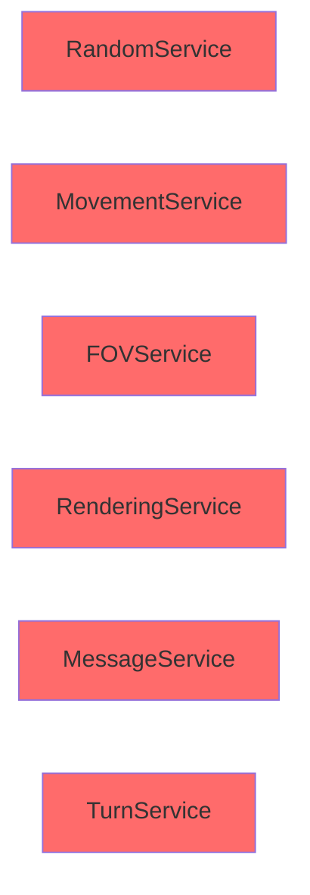
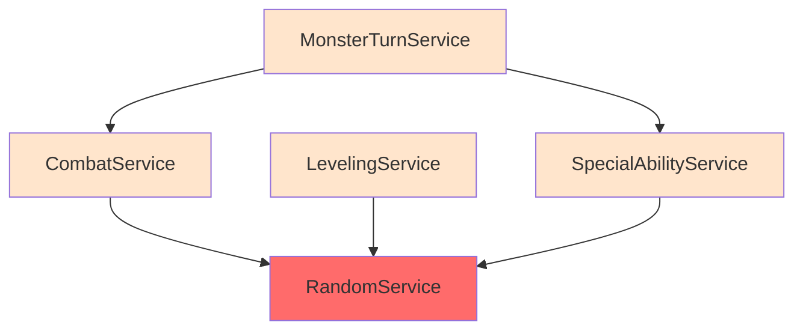
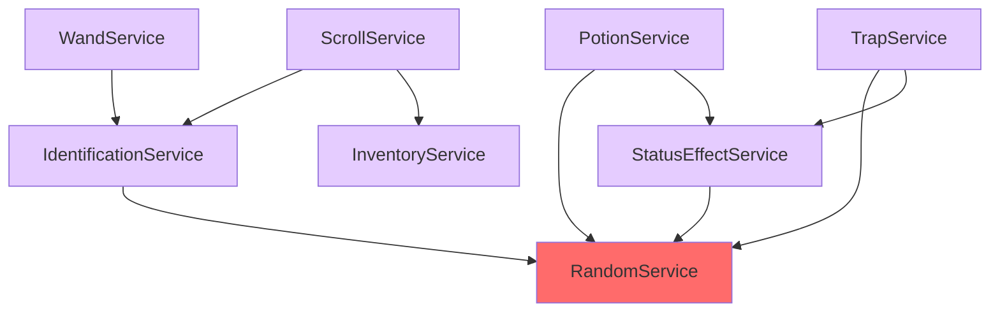
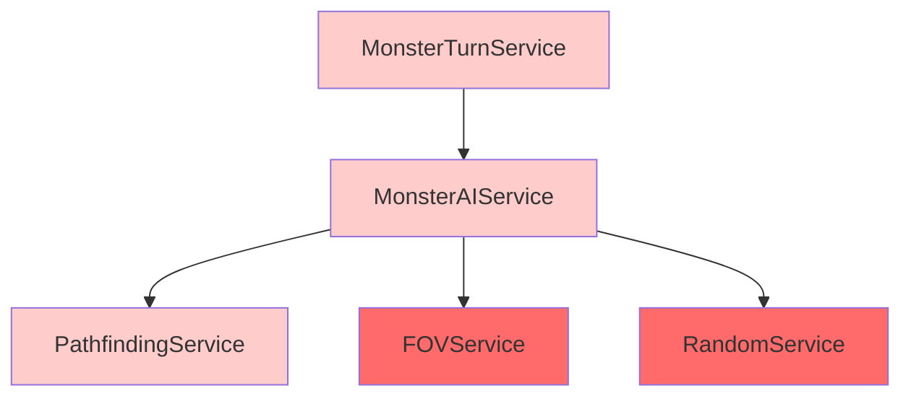
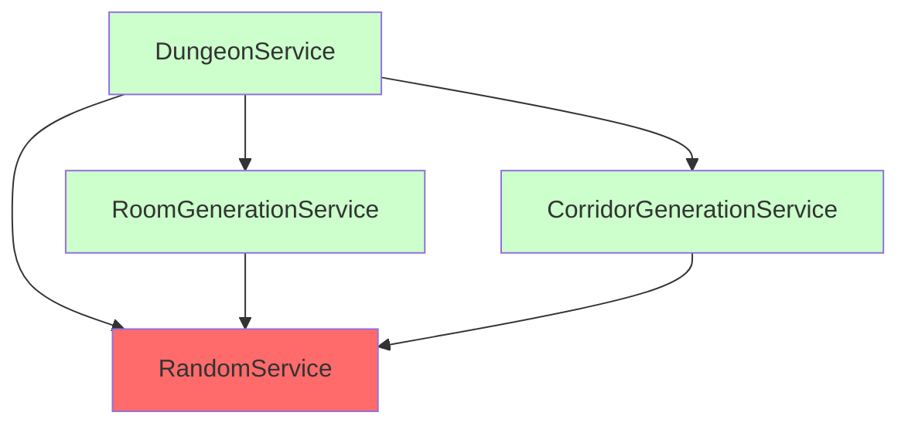
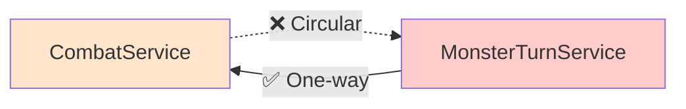
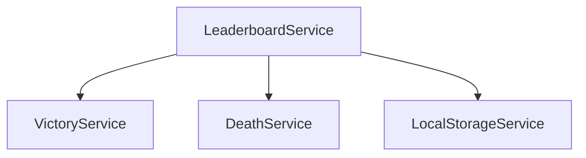

# Service Dependency Graph

**Version**: 1.0
**Last Updated**: 2025-10-06
**Related Docs**: [Architecture](../architecture.md) | [Services Index](../services/README.md)

---

## Overview

This diagram shows the dependency relationships between all 33 services in the ASCII Roguelike. The graph is **acyclic** (no circular dependencies), following the **Dependency Inversion Principle**.

**Key Insights**:
- **RandomService** is the most depended-upon service (12 dependencies)
- **Core services** (FOVService, MovementService) have no dependencies
- **High-level services** depend on low-level services, not vice versa
- Services can be tested in **dependency order** (bottom-up)

---

## Complete Dependency Graph

```mermaid
graph TB
    subgraph Core["Core Services (No Dependencies)"]
        Random[RandomService<br/>Seeded RNG]
        Movement[MovementService<br/>Position validation]
        FOV[FOVService<br/>Shadowcasting]
        Rendering[RenderingService<br/>Visibility colors]
        Message[MessageService<br/>Log management]
        Turn[TurnService<br/>Turn counter]
        LocalStorage[LocalStorageService<br/>Persistence]
        Door[DoorService<br/>Door states]
    end

    subgraph Combat["Combat & Leveling"]
        Combat[CombatService]
        Leveling[LevelingService]
        SpecialAbility[SpecialAbilityService]
    end

    subgraph Items["Item Systems"]
        Identification[IdentificationService]
        Inventory[InventoryService]
        Potion[PotionService]
        Scroll[ScrollService]
        Wand[WandService]
        Trap[TrapService]
        StatusEffect[StatusEffectService]
    end

    subgraph Generation["Dungeon Generation"]
        RoomGen[RoomGenerationService]
        CorridorGen[CorridorGenerationService]
        Dungeon[DungeonService]
        Level[LevelService]
    end

    subgraph MonsterAI["Monster AI & Pathfinding"]
        Pathfinding[PathfindingService]
        MonsterAI[MonsterAIService]
        MonsterTurn[MonsterTurnService]
    end

    subgraph PlayerSystems["Player Systems"]
        Hunger[HungerService]
        Lighting[LightingService]
        Regeneration[RegenerationService]
        Search[SearchService]
    end

    subgraph Support["UI Support"]
        Notification[NotificationService]
        Context[ContextService]
        Victory[VictoryService]
        Death[DeathService]
        Debug[DebugService]
    end

    %% Combat Dependencies
    Combat --> Random
    Leveling --> Random
    SpecialAbility --> Random

    %% Item Dependencies
    Identification --> Random
    Potion --> Random
    Potion --> StatusEffect
    Trap --> Random
    Trap --> StatusEffect
    Scroll --> Identification
    Scroll --> Inventory
    Wand --> Identification
    StatusEffect --> Random

    %% Generation Dependencies
    RoomGen --> Random
    CorridorGen --> Random
    Dungeon --> Random
    Dungeon --> RoomGen
    Dungeon --> CorridorGen

    %% Monster AI Dependencies
    MonsterAI --> Pathfinding
    MonsterAI --> FOV
    MonsterAI --> Random
    MonsterTurn --> MonsterAI
    MonsterTurn --> Combat
    MonsterTurn --> SpecialAbility
    MonsterTurn --> Message

    %% Player Systems Dependencies
    Hunger --> Random
    Lighting --> Random
    Regeneration --> FOV
    Search --> Random

    %% UI Support Dependencies
    Notification --> Identification
    Context --> Identification
    Debug --> Message

    %% Styling
    style Random fill:#FF6B6B
    style Core fill:#E8F4F8
    style Combat fill:#FFE5CC
    style Items fill:#E5CCFF
    style Generation fill:#CCFFCC
    style MonsterAI fill:#FFCCCC
    style PlayerSystems fill:#CCE5FF
    style Support fill:#FFFFCC
```

---

## Dependency Statistics

### Most Depended-Upon Services

| Service | Dependents | Description |
|---------|-----------|-------------|
| **RandomService** | 12 | Injected into all services needing randomness |
| **IdentificationService** | 5 | Used by Scroll, Wand, Potion, Notification, Context |
| **Combat** | 1 | Used by MonsterTurnService |
| **FOVService** | 2 | Used by MonsterAI, RegenerationService |
| **Message** | 2 | Used by MonsterTurn, DebugService |

### Services with No Dependencies

**8 Services** have zero dependencies (pure functions or stateful only):
1. RandomService (interfaces Math.random or seeded RNG)
2. MovementService (pure collision detection)
3. FOVService (pure shadowcasting algorithm)
4. RenderingService (pure color selection)
5. MessageService (simple log management)
6. TurnService (simple counter)
7. LocalStorageService (browser API wrapper)
8. DoorService (pure door state management)

---

## Dependency Chains

### Longest Dependency Chains

**MonsterTurnService** (depth 3):
```
MonsterTurnService → MonsterAIService → PathfindingService
MonsterTurnService → MonsterAIService → FOVService
MonsterTurnService → MonsterAIService → RandomService
MonsterTurnService → Combat → RandomService
MonsterTurnService → SpecialAbility → RandomService
```

**DungeonService** (depth 2):
```
DungeonService → RoomGenerationService → RandomService
DungeonService → CorridorGenerationService → RandomService
```

**ScrollService** (depth 2):
```
ScrollService → IdentificationService → RandomService
ScrollService → Inventory
```

---

## Dependency Clusters

### Core Utilities Cluster

Services that provide foundational utilities:



**Characteristics**:
- No dependencies on other services
- High-test priority (building blocks)
- Pure functions where possible

---

### Combat Cluster

Combat-related services:



---

### Item System Cluster

Item-related services:



---

### Monster AI Cluster

AI and pathfinding services:



---

### Dungeon Generation Cluster

Level generation services:



---

## Testing Order (Dependency-Based)

Services should be tested **bottom-up** based on dependencies:

### Level 0 (No Dependencies) - Test First
```
RandomService
MovementService
FOVService
RenderingService
MessageService
TurnService
LocalStorageService
DoorService
PathfindingService
InventoryService
```

### Level 1 (Depend Only on Level 0)
```
CombatService → RandomService
LevelingService → RandomService
SpecialAbilityService → RandomService
IdentificationService → RandomService
HungerService → RandomService
LightingService → RandomService
SearchService → RandomService
RoomGenerationService → RandomService
CorridorGenerationService → RandomService
StatusEffectService → RandomService
```

### Level 2 (Depend on Level 0-1)
```
PotionService → Random, StatusEffect
TrapService → Random, StatusEffect
ScrollService → Identification, Inventory
WandService → Identification
MonsterAIService → Pathfinding, FOV, Random
RegenerationService → FOV
NotificationService → Identification
ContextService → Identification
DungeonService → Random, RoomGen, CorridorGen
```

### Level 3 (Depend on Level 0-2)
```
MonsterTurnService → MonsterAI, Combat, SpecialAbility, Message
```

**Benefit**: Ensures dependencies are working before testing dependent services

---

## Why No Circular Dependencies?

**Acyclic Dependency Graph** ensures:
- ✅ Testability (no mocking nightmares)
- ✅ Modularity (services can be extracted)
- ✅ Clarity (clear data flow)
- ✅ Maintainability (changes don't ripple uncontrollably)

**Example of Avoided Circular Dependency**:



**Solution**: MonsterTurnService depends on CombatService (not vice versa)

---

## Dependency Injection Example

**CombatService** constructor:

```typescript
export class CombatService {
  constructor(
    private random: IRandomService  // Injected dependency
  ) {}

  calculateDamage(weapon: Weapon): number {
    return this.random.roll(weapon.damage)  // Uses injected service
  }
}
```

**MonsterTurnService** constructor:

```typescript
export class MonsterTurnService {
  constructor(
    private monsterAI: MonsterAIService,    // Injected
    private combat: CombatService,          // Injected
    private specialAbility: SpecialAbilityService,  // Injected
    private message: MessageService         // Injected
  ) {}
}
```

**Benefits**:
- ✅ Testable (can inject mocks)
- ✅ Flexible (can swap implementations)
- ✅ Clear dependencies (explicit in constructor)

---

## Service Categories

### By Responsibility

**Core Utilities** (8 services):
- RandomService, MovementService, FOVService, RenderingService
- MessageService, TurnService, LocalStorageService, DoorService

**Combat Systems** (4 services):
- CombatService, LevelingService, SpecialAbilityService, MonsterTurnService

**Item Systems** (7 services):
- IdentificationService, InventoryService, PotionService, ScrollService
- WandService, TrapService, StatusEffectService

**Dungeon Generation** (4 services):
- DungeonService, RoomGenerationService, CorridorGenerationService, LevelService

**Monster AI** (2 services):
- MonsterAIService, PathfindingService

**Player Systems** (4 services):
- HungerService, LightingService, RegenerationService, SearchService

**UI Support** (5 services):
- NotificationService, ContextService, VictoryService, DeathService, DebugService

---

## Adding New Services

**When adding a new service**, follow these steps:

1. **Identify dependencies** - Which services does it need?
2. **Check for cycles** - Would it create circular dependencies?
3. **Inject dependencies** - Pass via constructor
4. **Update this diagram** - Add node and edges
5. **Test bottom-up** - Ensure dependencies are tested first

**Example**: Adding `LeaderboardService`

```typescript
// Dependencies: VictoryService, DeathService, LocalStorageService
export class LeaderboardService {
  constructor(
    private victoryService: VictoryService,
    private deathService: DeathService,
    private storage: LocalStorageService
  ) {}
}
```

**Diagram Update**:


---

## Related Diagrams

- **[Architecture Layers](./architecture-layers.md)** - How services fit in overall architecture
- **[Command Flow](./command-flow.md)** - How commands use multiple services
- **[Data Model](./data-model.md)** - What data services operate on

---

## References

- **[Services Index](../services/README.md)** - Documentation for all 33 services
- **[Architecture](../architecture.md)** - Service layer specifications
- **[Dependency Inversion Principle](https://en.wikipedia.org/wiki/Dependency_inversion_principle)**

---

**Last Updated**: 2025-10-06
**Maintained By**: Development Team
**Update Frequency**: After adding/removing services or changing dependencies
