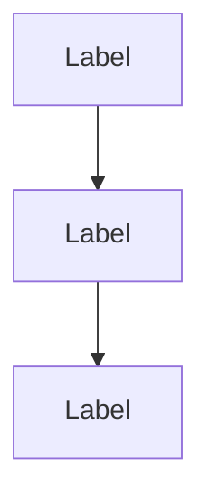
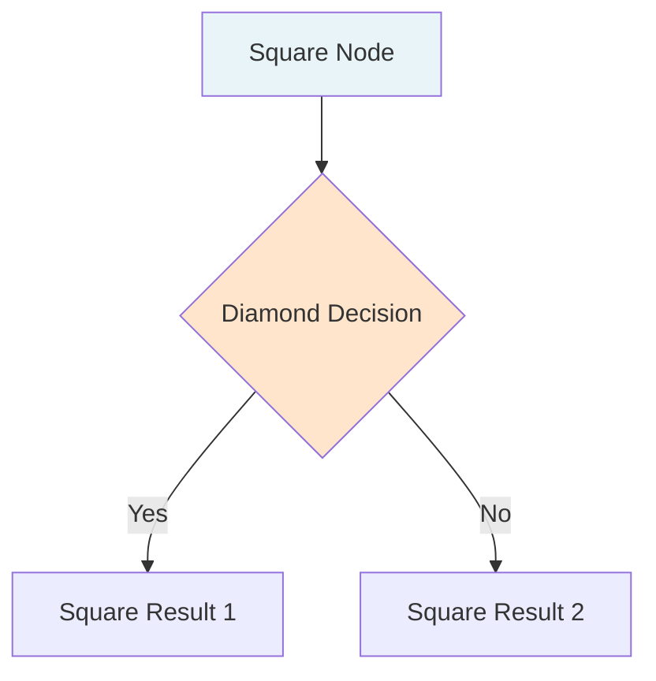
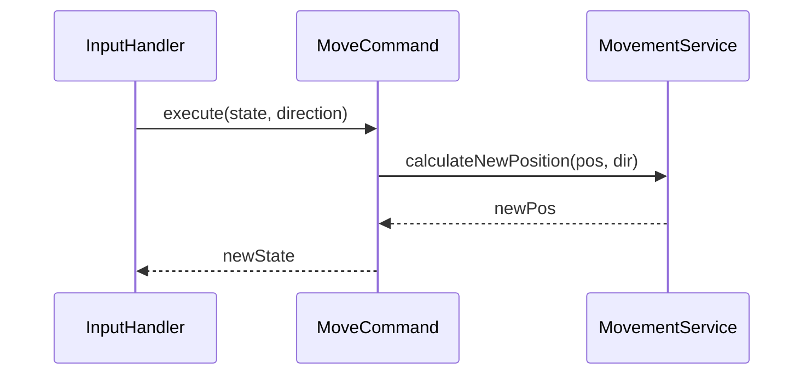
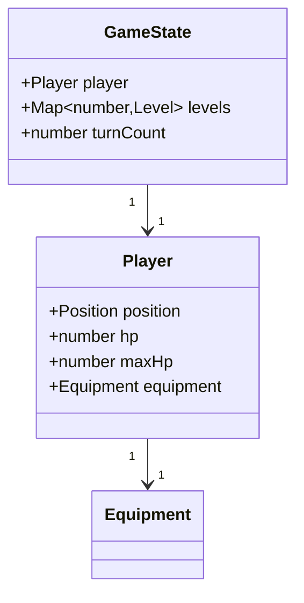
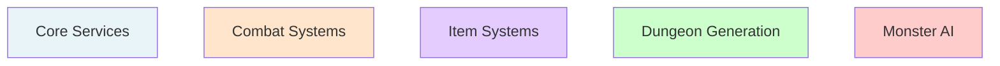
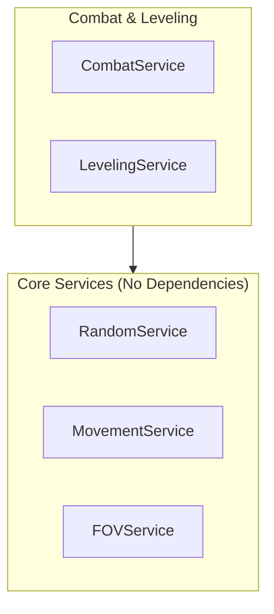

# Documentation Writing Guide

**Version**: 1.0
**Last Updated**: 2025-10-06
**Purpose**: Comprehensive guide for writing all documentation types in this project
**Related Docs**: [Contributing](./contributing.md) | [README](./README.md) | [Plan Template](./plans/TEMPLATE.md)

---

## Overview

This guide consolidates all documentation standards and establishes patterns for creating clear, consistent, and maintainable documentation. All documentation in this project follows these principles to ensure quality and discoverability.

**Documentation Philosophy**:
- **Code-first**: Show working examples, then explain
- **Scenario-based**: Organize by use case, not by method
- **Concise**: Under 500 lines per document
- **Cross-referenced**: Link to related docs extensively
- **Living**: Update when code changes

---

## Table of Contents

1. [General Principles](#1-general-principles)
2. [Documentation Types & Templates](#2-documentation-types--templates)
3. [Writing Style & Tone](#3-writing-style--tone)
4. [Code Examples Best Practices](#4-code-examples-best-practices)
5. [Mermaid Diagram Standards](#5-mermaid-diagram-standards)
6. [Markdown Conventions](#6-markdown-conventions)
7. [Cross-Reference Patterns](#7-cross-reference-patterns)
8. [Review Checklist](#8-review-checklist)

---

## 1. General Principles

### Document Length

**Rule**: Keep documents under 500 lines (including whitespace)

**Why**: Long documents are hard to navigate and maintain. Split when approaching limit.

**How to Split**:
```
# Before (800 lines)
docs/services/inventory-system.md

# After
docs/services/InventoryService.md           (200 lines)
docs/services/creation-guide.md            (250 lines)
docs/services/patterns.md                  (200 lines)
docs/services/testing-guide.md             (150 lines)
```

**Organize by topic/scenario**, not by splitting randomly at line 500.

---

### File Naming Conventions

**Services**: `ServiceName.md` (PascalCase matching class name)
```
LightingService.md
FOVService.md
MonsterAIService.md
```

**Commands**: `command-name.md` (kebab-case matching user action)
```
move.md
open-door.md
debug-godmode.md
```

**Guides**: `topic-name.md` (kebab-case describing content)
```
creation-guide.md
testing-guide.md
patterns.md
```

**Game Design**: `NN-topic.md` (numbered for reading order)
```
01-overview.md
02-character.md
03-combat.md
```

**Plans**: `feature_name_plan.md` (snake_case with _plan suffix)
```
scroll_implementation_plan.md
leaderboard_system_design.md
```

**Diagrams**: `topic-name.md` (kebab-case describing diagram)
```
architecture-layers.md
service-dependencies.md
command-flow.md
```

---

### Metadata Headers

**Every document must start with**:

```markdown
# Document Title

**Version**: 1.0
**Last Updated**: YYYY-MM-DD
**Purpose/Location**: [Brief description or file path]
**Related Docs**: [Link 1](./path.md) | [Link 2](./path.md)

---
```

**Update "Last Updated"** when making changes (even small ones).

---

### When to Update Documentation

| Trigger | Action |
|---------|--------|
| **New service created** | Create `docs/services/ServiceName.md` |
| **New command created** | Create `docs/commands/command-name.md` |
| **New feature implemented** | Update relevant game design doc |
| **Architecture change** | Update `architecture.md` and related diagrams |
| **New pattern discovered** | Update `patterns.md` or create guide |
| **Recurring bug fixed** | Update `troubleshooting.md` |
| **Test strategy change** | Update `testing-strategy.md` |

**Rule**: Documentation is part of the feature, not an afterthought.

---

## 2. Documentation Types & Templates

### Service Documentation

**Template Structure** (see `docs/services/LightingService.md` as example):

```markdown
# ServiceName

**Location**: `src/services/ServiceName/ServiceName.ts`
**Dependencies**: Service1, Service2
**Test Coverage**: Brief description of what's tested

---

## Purpose

[1-2 sentence explanation of what this service does and why it exists]

---

## Public API

### Method Category 1

#### `methodName(param: Type): ReturnType`
[Brief description of what method does]

**Parameters**:
- `param` - [Description]

**Returns**:
```typescript
interface ReturnType {
  field: Type  // Description
}
```

**Example**:
```typescript
const result = service.methodName(param)
// result.field: expected value
```

---

### Method Category 2

[Repeat pattern for all public methods]

---

## Usage Examples

### Common Scenario 1
[Real-world example code]

### Common Scenario 2
[Real-world example code]

---

## Design Decisions

### Why [Decision]?
[Explanation of architectural choice]

---

## Testing Notes

[Key scenarios to test, edge cases, MockRandom usage]

---

## Related Documentation

- [Related Service](./RelatedService.md)
- [Related System](../systems-core.md#system)
```

**Key Points**:
- Start with **Purpose** (why it exists)
- Document **Public API** only (not private methods)
- Include **TypeScript interfaces** for return types
- Provide **runnable code examples**
- Explain **design decisions** (not just what, but why)

---

### Command Documentation

**Template Structure** (see `docs/commands/move.md` as example):

```markdown
# Command Name

**Keybinding**: `key` or `Shift+Key`
**Consumes Turn**: Yes/No
**Implementation**: `src/commands/CommandName/CommandName.ts`

---

## Purpose

[1-2 sentence explanation of what command does]

---

## Behavior

### Normal Case
[What happens in typical usage]

### Edge Case 1
[What happens in special condition]

### Edge Case 2
[What happens in error condition]

---

## Turn Side Effects

When command succeeds (consumes turn):

| System | Effect | Details |
|--------|--------|---------|
| **System1** | Description | Specifics |
| **System2** | Description | Specifics |

---

## Services Used

- **ServiceName**: What it's used for
- **ServiceName**: What it's used for

---

## Special Rules

1. **Rule 1**: Explanation
2. **Rule 2**: Explanation

---

## Code Flow

```
CommandName.execute()
├── Step 1 (Service call)
├── Step 2 (Logic branch)
└── Return new state
```

---

## Examples

### Example 1: Common Case
```typescript
// Setup
const state = { ... }

// Execute
const result = command.execute(state, params)

// Expected
expect(result.field).toBe(expected)
```

---

## Related Commands

- [Related Command](./related.md)
```

**Key Points**:
- Start with **keybinding** (user-facing)
- Clearly state **turn consumption** (affects gameplay)
- Show **behavior** for all cases (normal + edge cases)
- List **services used** (architecture transparency)
- Include **code flow** diagram
- Provide **runnable examples**

---

### Game Design Documentation

**Template Structure** (see `docs/game-design/03-combat.md` as example):

```markdown
# System Name (e.g., Combat System)

**Status**: ✅ Complete / 🚧 In Progress
**Version**: 1.0
**Last Updated**: YYYY-MM-DD

---

## Overview

[2-3 sentence description of the system]

**Key Features**:
- Feature 1
- Feature 2
- Feature 3

---

## Mechanics

### Mechanic 1: [Name]

**Formula**:
```
damage = roll(weapon.damage) + strength_bonus
```

**Example**:
```
Weapon: Mace (2d4)
Strength: 16 (+1 bonus)
Roll: 3, 4 → 7 base damage
Final: 7 + 1 = 8 damage
```

**Edge Cases**:
- Case 1: Behavior
- Case 2: Behavior

---

### Mechanic 2: [Name]

[Repeat pattern]

---

## Data Tables

### Table 1: [Name]

| Item | Property | Value | Notes |
|------|----------|-------|-------|
| Item 1 | Prop | Val | Note |

---

## Formulas & Calculations

**Formula Name**:
```
result = base × modifier + bonus
```

**Variables**:
- `base` - Description (range)
- `modifier` - Description (range)
- `bonus` - Description (range)

---

## Implementation Notes

**Services**:
- ServiceName: Implements formula X
- ServiceName: Handles edge case Y

**See**: [Service Docs](../services/ServiceName.md)

---

## References

- **Classic Rogue**: [Mechanic description]
- **NetHack**: [Variant or inspiration]
```

**Key Points**:
- **Mechanics-first** (what the system does)
- **Formulas with examples** (show the math)
- **Tables for data** (monsters, items, levels)
- **Implementation links** (connect design to code)
- **Classic roguelike references** (provenance)

---

### Plan Documents

**Use the template**: `docs/plans/TEMPLATE.md`

**Key Sections**:
1. **Objectives** - What and why
2. **Context & Related Docs** - Links to relevant documentation
3. **Phases & Tasks** - Checklist-driven roadmap
4. **Technical Design** - Data models, services, commands
5. **Testing Strategy** - Coverage targets, scenarios
6. **Integration** - How it fits existing systems
7. **Future Work** - What's deferred

**Best Practices**:
- **Checklist every task** - Track progress with `[ ]` and `[x]`
- **Reference existing docs** - Don't duplicate, link
- **Estimate complexity** - Mark phases as HIGH/MEDIUM/LOW priority
- **Update as you go** - Mark tasks complete, add discoveries
- **Archive when done** - Move to `docs/plans/` with status update

---

### Diagram Documentation

**Template Structure** (see `docs/diagrams/architecture-layers.md` as example):

```markdown
# Diagram Name

**Version**: 1.0
**Last Updated**: YYYY-MM-DD
**Related Docs**: [Doc 1](../path.md) | [Doc 2](../path.md)

---

## Overview

[2-3 sentences explaining what the diagram shows and why it's useful]

**Key Insights**:
- Insight 1
- Insight 2

---

## [Diagram Section 1]



**Explanation**:
- Node1: What it represents
- Node2: What it represents
- Arrows: What the connections mean

---

## [Diagram Section 2]

[Repeat pattern - diagram followed by explanation]

---

## Code Examples

**Show the pattern in code**:
```typescript
// Example demonstrating the diagram concept
```

---

## Related Diagrams

- [Related Diagram](./related-diagram.md)
```

**Key Points**:
- **Mermaid diagrams** (GitHub-native rendering)
- **Explain after showing** (diagram first, then text)
- **Include code examples** (connect diagrams to implementation)
- **Cross-reference** (link to related diagrams)

See [Section 5: Mermaid Diagram Standards](#5-mermaid-diagram-standards) for syntax details.

---

## 3. Writing Style & Tone

### General Tone

**✅ Good**:
- "The service returns a new object with updated fuel."
- "FOV uses recursive shadowcasting for efficient visibility."
- "Monsters enter HUNTING state when player is detected."

**❌ Avoid**:
- "This amazing service returns..." (unnecessary hype)
- "Let's explore how FOV works!" (too casual)
- "The monster will hunt you down!" (player-directed tone)

**Principles**:
- **Technical accuracy** over friendliness
- **Direct statements** over questions
- **Active voice** over passive voice
- **Present tense** for current behavior

---

### Code-First Approach

**Pattern**: Show code first, then explain

**✅ Good**:
```markdown
```typescript
const result = service.tickFuel(player)
// player.equipment.lightSource.fuel: 450 → 449
```

This consumes 1 fuel per turn and returns warnings at thresholds.
```

**❌ Avoid**:
```markdown
The fuel consumption system works by calling tickFuel which takes
a player object and decrements the fuel property and then checks
if warnings should be displayed...
```

**Rule**: If you can show it in code, do that instead of prose.

---

### Avoid Preamble

**✅ Good**:
```markdown
## Purpose

Manages light sources (torches, lanterns, artifacts), fuel consumption, and vision radius.
```

**❌ Avoid**:
```markdown
## Purpose

In this section, we'll discuss the LightingService which is responsible for
handling various aspects of the lighting system including but not limited to...
```

**Rule**: Get to the point in the first sentence.

---

### Use Examples Liberally

**Every concept needs an example**:

```markdown
### Hunger Warnings

**Thresholds**:
- 300 turns: "You are getting hungry."
- 150 turns: "You are hungry."
- 20 turns: "You are very hungry!"
- 10 turns: "You are starving!"

**Example**:
```typescript
const player = { hunger: 150 }
const result = hungerService.tickHunger(player)
// result.messages: ["You are hungry."]
```
```

**Don't just list properties** - show them in action.

---

### Good vs Bad Patterns

**Use comparison tables** to clarify correct usage:

```markdown
| Pattern | Example | Why It's Bad | Fix |
|---------|---------|--------------|-----|
| Loops in commands | `forEach` | Business logic | Extract to service |
| State mutation | `state.hp -= 1` | Violates immutability | Return new object |
```

**Or use emoji markers**:

```markdown
```typescript
// ✅ Good - Immutable
const newPlayer = { ...player, hp: player.hp - 1 }

// ❌ Bad - Mutation
player.hp -= 1
```
```

---

## 4. Code Examples Best Practices

### TypeScript Syntax Highlighting

**Always specify language**:

````markdown
```typescript
const service = new LightingService(randomService)
```
````

**Common languages in this project**:
- `typescript` - Most code examples
- `bash` - Command line examples
- `json` - Configuration/data files
- `mermaid` - Diagrams
- ` ` (no language) - Plain text output

---

### Complete, Runnable Examples

**✅ Good** (can copy-paste and run):
```typescript
// Arrange
const mockRandom = new MockRandom([0.8])  // High roll
const service = new CombatService(mockRandom)
const weapon: Weapon = {
  id: 'weapon-1',
  name: 'Mace',
  type: ItemType.WEAPON,
  damage: '2d4',
  bonus: 0
}

// Act
const damage = service.rollDamage(weapon)

// Assert
expect(damage).toBe(7)  // (0.8 × 4) × 2 + (0.8 × 4) × 2 = 3 + 3 + 1
```

**❌ Avoid** (missing context):
```typescript
const damage = service.rollDamage(weapon)
expect(damage).toBe(7)
```

---

### Show Expected Output

**Use comments** to show expected results:

```typescript
const result = service.tickFuel(player)
// player.equipment.lightSource.fuel: 450 → 449
// result.messages: [] (no warning yet)
```

Or use **inline assertions**:

```typescript
expect(result.player.equipment.lightSource.fuel).toBe(449)
expect(result.messages).toHaveLength(0)
```

---

### TypeScript Interfaces

**Always include return type interfaces**:

```markdown
**Returns**:
```typescript
interface FuelTickResult {
  player: Player         // Updated with depleted fuel
  messages: Message[]    // Fuel warnings (empty if no warnings)
}
```
```

**Benefits**:
- Shows exact structure
- Documents field meanings
- TypeScript users can copy interface

---

### Scenario-Based Examples

**Group by use case**, not by method:

```markdown
## Usage Examples

### Scenario 1: Normal Movement (No Warnings)
```typescript
const player = { equipment: { lightSource: { fuel: 450 } } }
const result = service.tickFuel(player)
// No warnings
```

### Scenario 2: Low Fuel Warning
```typescript
const player = { equipment: { lightSource: { fuel: 50 } } }
const result = service.tickFuel(player)
// result.messages: ["Your torch is getting dim..."]
```

### Scenario 3: Fuel Depleted
```typescript
const player = { equipment: { lightSource: { fuel: 0 } } }
const result = service.tickFuel(player)
// result.messages: ["Your torch goes out!"]
// player.equipment.lightSource: null (unequipped)
```
```

---

## 5. Mermaid Diagram Standards

### Diagram Types

**Use the right diagram for the job**:

| Type | Use Case | Example |
|------|----------|---------|
| `graph` / `flowchart` | Architecture, dependencies, flows | `graph TD` (top-down), `graph LR` (left-right) |
| `sequenceDiagram` | Service calls, command execution | Message passing between entities |
| `classDiagram` | Data models, entity relationships | GameState, Player, Monster |
| `stateDiagram-v2` | State machines | Monster AI states, door states |

---

### Graph/Flowchart Syntax

**Basic structure**:



**Node shapes**:
- `A[Text]` - Rectangle (default)
- `A(Text)` - Rounded rectangle
- `A{Text}` - Diamond (decision)
- `A((Text))` - Circle
- `A>Text]` - Asymmetric (flag)

**Edge types**:
- `A --> B` - Solid arrow
- `A -.-> B` - Dotted arrow
- `A ==> B` - Thick arrow
- `A -->|Label| B` - Labeled arrow

---

### Sequence Diagram Syntax

**Basic structure**:



**Participants**:
- `participant Name as Label` - Define entity
- `participant Name` - Use class name

**Messages**:
- `A->>B: message` - Solid arrow (request)
- `A-->>B: message` - Dashed arrow (response)
- `A->>+B: message` - Activate lifeline
- `A->>-B: message` - Deactivate lifeline

**Notes**:
- `Note over A: Text` - Note over one entity
- `Note over A,B: Text` - Note spanning multiple entities

**Grouping**:
```mermaid
rect rgb(200, 230, 255)
    Note over CMD: Step 1: Calculate Movement
    CMD->>SVC: calculateNewPosition()
end
```

---

### Class Diagram Syntax

**Basic structure**:



**Relationships**:
- `A "1" --> "1" B` - One-to-one
- `A "1" --> "*" B` - One-to-many
- `A <|-- B` - Inheritance (B extends A)
- `A <|.. B` - Implementation (B implements A)

---

### Color Coding Standards

**Consistent colors** for functional areas:



**Color palette**:
- **Core/Utilities**: `#E8F4F8` (light blue)
- **Combat**: `#FFE5CC` (light orange)
- **Items**: `#E5CCFF` (light purple)
- **Generation**: `#CCFFCC` (light green)
- **Monster AI**: `#FFCCCC` (light red)
- **Highlight/Important**: `#FF6B6B` (bright red)

---

### Subgraph Organization

**Group related nodes**:



---

## 6. Markdown Conventions

### Header Hierarchy

**Rules**:
1. **One `#` (H1)** per document (the title)
2. **`##` (H2)** for major sections
3. **`###` (H3)** for subsections
4. **`####` (H4)** for method names or specific details

**Example**:

```markdown
# ServiceName

## Purpose

## Public API

### Method Category 1

#### `methodName(param: Type): ReturnType`

### Method Category 2

#### `anotherMethod(): void`
```

**Don't skip levels** (e.g., H2 → H4 without H3).

---

### Code Blocks

**Always use fenced code blocks** with language:

````markdown
```typescript
const service = new LightingService()
```
````

**Never use indented code blocks**:

```markdown
    const service = new LightingService()  // ❌ Don't do this
```

---

### Tables

**Use tables for comparisons**:

```markdown
| Column 1 | Column 2 | Column 3 |
|----------|----------|----------|
| Value 1  | Value 2  | Value 3  |
```

**Alignment**:

```markdown
| Left | Center | Right |
|:-----|:------:|------:|
| A    | B      | C     |
```

**Keep cells concise** - use bullets or separate paragraphs for long content.

---

### Lists

**Unordered lists** for non-sequential items:

```markdown
- Item 1
- Item 2
  - Nested item
- Item 3
```

**Ordered lists** for sequential steps:

```markdown
1. First step
2. Second step
3. Third step
```

**Checklist** for tasks:

```markdown
- [ ] Task not done
- [x] Task completed
```

---

### Emphasis

**Bold** for **emphasis** or **property names**:

```markdown
The **player** has **hp** and **maxHp** properties.
```

**Italic** for _terms_ or _references_:

```markdown
The _FOV algorithm_ uses _recursive shadowcasting_.
```

**Code** for `inline code`, `variable names`, `types`:

```markdown
The `GameState` contains a `player` field of type `Player`.
```

**Don't overuse** - too much emphasis reduces readability.

---

### Horizontal Rules

**Use `---`** to separate major sections:

```markdown
## Section 1

Content here.

---

## Section 2

Content here.
```

---

### Links

**Relative links** to other docs:

```markdown
See [Architecture](./architecture.md) for details.
See [FOV System](./systems-core.md#fov-system) for section link.
```

**Absolute links** for external resources:

```markdown
See [Mermaid Docs](https://mermaid.js.org/intro/) for syntax.
```

---

## 7. Cross-Reference Patterns

### Linking Between Documents

**Always use relative paths** from current document:

```markdown
# From docs/services/LightingService.md

See [FOVService](./FOVService.md) for visibility calculation.
See [Architecture](../architecture.md) for layer overview.
See [Lighting System](../systems-core.md#lighting-system) for game design.
```

**Link to sections** using `#anchor` (lowercase, hyphens for spaces):

```markdown
See [Testing Best Practices](../architecture.md#testing-best-practices)
```

---

### Related Documentation Sections

**Every doc should end with related links**:

```markdown
---

## Related Documentation

- [Related Service](./RelatedService.md) - Brief description
- [Related System](../systems-core.md#system-name) - Brief description
- [Architecture](../architecture.md) - Layer specifications
```

**Why**: Helps readers discover connected information.

---

### Navigation Aids

**Create README.md indexes** for folders:

```markdown
# Services Documentation

**Quick Links**: [Core](#core) | [Combat](#combat) | [Items](#items)

## Core Services

- [RandomService](./RandomService.md) - Seeded RNG
- [MovementService](./MovementService.md) - Position validation

## Combat Services

- [CombatService](./CombatService.md) - Damage calculation
- [LevelingService](./LevelingService.md) - XP and leveling
```

**Benefits**:
- Single entry point for discovery
- Categorized organization
- Quick navigation

---

### Learning Paths

**Create progressive reading orders**:

```markdown
### Beginner Path (Week 1)

1. **Day 1-2**: Read [Getting Started](./getting-started.md) + [CLAUDE.md](../CLAUDE.md)
2. **Day 3**: Read [Architecture](./architecture.md) (focus on layers)
3. **Day 4**: Read [Service Creation Guide](./services/creation-guide.md)
```

**Why**: Guides new developers through information overload.

---

## 8. Review Checklist

### Before Committing Documentation

**Completeness**:
- [ ] Metadata header present (Version, Last Updated, Related Docs)
- [ ] Purpose/overview section at top
- [ ] Code examples for every concept
- [ ] Related documentation links at bottom
- [ ] Under 500 lines (or intentionally split)

**Accuracy**:
- [ ] Code examples tested and working
- [ ] TypeScript interfaces match actual code
- [ ] Method signatures match implementation
- [ ] Links point to existing files/sections

**Clarity**:
- [ ] Direct, concise language (no preamble)
- [ ] Code-first approach (show then explain)
- [ ] Good vs bad examples where applicable
- [ ] Consistent terminology throughout

**Formatting**:
- [ ] One H1 (title only)
- [ ] Proper header hierarchy (H2 → H3 → H4)
- [ ] Fenced code blocks with language tags
- [ ] Tables properly formatted
- [ ] Mermaid diagrams render correctly

**Cross-References**:
- [ ] Links to related services/commands
- [ ] Links to architecture/game design docs
- [ ] Links to testing guides
- [ ] Links work (no 404s)

---

### Testing Documentation Links

**Verify all links**:

```bash
# Find all markdown links
grep -r "\[.*\](.*)" docs/

# Check for common link issues
grep -r "\[.*\](../" docs/  # Relative paths
grep -r "\[.*\](#" docs/    # Anchor links
```

**Common issues**:
- ❌ `./docs/architecture.md` (should be `../architecture.md` from services folder)
- ❌ `#FOV-System` (should be `#fov-system` - lowercase)
- ❌ `[Link](path.md#section)` with typo in section anchor

---

### Mermaid Diagram Testing

**Verify diagrams render**:

1. Copy diagram code
2. Paste into [Mermaid Live Editor](https://mermaid.live/)
3. Check for syntax errors
4. Preview rendering
5. Fix any issues

**Or use GitHub preview**:
- Create PR with diagram
- Check "Files changed" tab
- Verify diagram renders correctly

---

### Consistency Checks

**Use consistent terminology**:

| ✅ Use | ❌ Avoid |
|-------|---------|
| GameState | game state, State, state object |
| FOV | field of view (spell out first use, then FOV) |
| HP | health, hit points (use HP consistently) |
| Service | manager, handler (use Service for service layer) |
| Command | action, handler (use Command for command layer) |

**Match codebase naming**:
- Use exact class names: `LightingService`, not `LightService`
- Use exact method names: `tickFuel()`, not `decrementFuel()`
- Use exact type names: `GameState`, not `Game`

---

## Quick Reference

### Document Templates

- **Service**: Purpose → Public API → Examples → Testing → Related Docs
- **Command**: Keybinding → Behavior → Services → Code Flow → Examples
- **Game Design**: Overview → Mechanics → Formulas → Tables → Implementation
- **Plan**: Objectives → Context → Phases → Design → Testing → Integration
- **Diagram**: Overview → Mermaid → Explanation → Code → Related Diagrams

### Writing Checklist

- [ ] Code-first (show then explain)
- [ ] Under 500 lines
- [ ] Examples for every concept
- [ ] Cross-references to related docs
- [ ] Metadata header (Version, Last Updated)
- [ ] No preamble or fluff
- [ ] TypeScript syntax highlighting
- [ ] Links tested

### Common Patterns

**Good vs Bad Example**:
```markdown
```typescript
// ✅ Good - Pattern
code here

// ❌ Bad - Anti-pattern
code here
```
```

**Comparison Table**:
```markdown
| Pattern | Why Bad | Fix |
|---------|---------|-----|
| Anti-pattern | Reason | Solution |
```

**Scenario Example**:
```markdown
### Scenario: Use Case Name
```typescript
// Arrange
const setup = ...

// Act
const result = ...

// Assert / Expected
expect(result).toBe(...)
```
```

---

## Questions?

- **Missing template?** Use closest existing doc as reference, create new template
- **Unclear standard?** Check similar docs, ask in issue/PR
- **Found issue?** Update this guide and submit PR

---

**Last Updated**: 2025-10-06
**Maintained By**: Development Team
**See Also**: [Contributing Guide](./contributing.md) | [Documentation Hub](./README.md)
